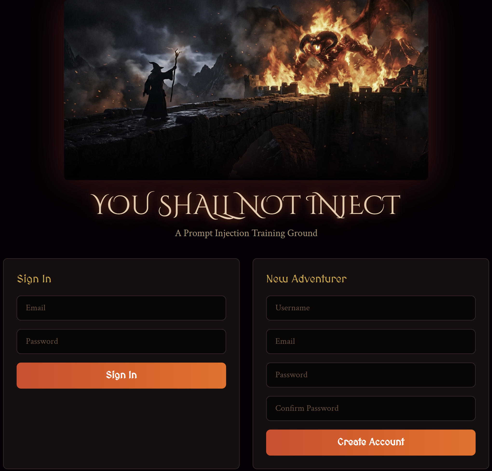

     

# You Shall Not Inject

A 5-level prompt injection challenge app. Craft adversarial prompts, bypass LLM guardrails, and learn how prompt injection actually works -- by doing it.

<p align="center">
  
</p>

**Live:** https://you-shall-not-inject.netlify.app

## Features

- JWT authentication with signup/login and 401 auto-logout
- 5 sequential challenge levels with progression gating (beat level N-1 to unlock level N)
- Real-time LLM evaluation of submitted prompts with pass/fail verdict
- Submission history with inline edit and delete
- User profile with progress tracking
- Dark terminal-style UI throughout

## Tech Stack

- **React 18** with Vite 4
- **React Router 6** -- client-side routing with protected routes
- **Tailwind CSS 3** via PostCSS (no custom CSS files beyond Tailwind directives)
- **Axios** -- centralized instance with request/response interceptors
- **Vitest** + jsdom + React Testing Library for unit tests
- **Playwright** for E2E tests

## Design Decisions

- **React 18** — Component-based architecture makes it natural to build each challenge level as an isolated, reusable view. The ecosystem and community support made it the clear choice for a single-page application.
- **Vite** — Chosen over Create React App for significantly faster hot module replacement during development and leaner production builds. Native ES module support eliminates bundling overhead in dev.
- **Tailwind CSS** — Utility-first approach enables rapid UI iteration without context-switching to separate stylesheets. Custom theme configuration made it straightforward to implement the LOTR-inspired fantasy aesthetic consistently across all components.
- **Axios** — Provides interceptors for attaching JWT tokens and handling 401 responses globally, which simplified the auth flow compared to the native Fetch API.
- **Vitest + Playwright** — Vitest integrates natively with Vite's transform pipeline so tests run against the same config as the dev server. Playwright provides reliable cross-browser E2E testing with auto-waiting, critical for testing the multi-step challenge flows.

## Getting Started

### Prerequisites

- Node.js v18+
- Backend API running on `http://localhost:5000` (see the `../backend` repo)

### Environment

Create a `.env` file (or copy `.env.example`):

```env
VITE_API_URL=http://localhost:5000
```

That's the only env var. It defaults to `http://localhost:5000` if unset.

### Install and Run

```bash
npm install
npm run dev        # Vite dev server on http://localhost:5173
```

### Build

```bash
npm run build      # Production bundle in dist/
npm run preview    # Preview the production build locally
```

## Project Structure

```
src/
  App.jsx                         # Router setup, AuthProvider wrapper
  main.jsx                        # Entry point, renders App into DOM
  index.css                       # Tailwind directives + dark color-scheme

  pages/
    Landing.jsx                   # Public landing with login + signup forms
    Dashboard.jsx                 # Challenge grid with progress gating
    ChallengePage.jsx             # Loads a challenge by :id, delegates to workspace
    ProfilePage.jsx               # User profile + submission history (edit/delete)

  components/
    NavBar.jsx                    # Shared top nav, renders children as right-side actions
    ChallengeCard.jsx             # Single challenge tile (locked/unlocked states)
    ChallengeWorkspace.jsx        # Prompt textarea, submit button, response display
    ResponseDisplay.jsx           # LLM response + pass/fail verdict + hint
    LoginForm.jsx                 # Email/password form with error handling
    SignupForm.jsx                # Username/email/password/confirm form
    FormInput.jsx                 # Reusable styled input
    ProtectedRoute.jsx            # Redirects to / if no token

  context/
    AuthContext.jsx               # React context: user, token, login(), logout(), loading

  hooks/
    useAuth.js                    # Convenience hook for AuthContext
    useChallenges.js              # Fetches all challenges from API
    useSubmissions.js             # Fetches submissions, exposes update/delete

  services/
    api.js                        # Axios instance + authAPI, progressAPI, challengeAPI, submissionAPI
    progress.js                   # isLevelUnlocked() -- gating logic

e2e/
  app.e2e.spec.js                 # Playwright E2E test suite

playwright.config.js              # Playwright config (auto-starts backend + frontend)
vite.config.js                    # Vite + Vitest config
tailwind.config.js                # Tailwind configuration
netlify.toml                      # Netlify build + SPA redirect rules
```

## Key Components

**ChallengeWorkspace** -- The main interaction surface. Renders the challenge description, a prompt textarea, and submit button. On submission, sends the prompt to the backend LLM endpoint and passes the result to ResponseDisplay.

**ResponseDisplay** -- Shows the raw LLM response text, a pass/fail indicator, and an optional hint. Uses emerald for pass, rose for fail.

**ProtectedRoute** -- Wraps any route that requires authentication. Checks for a token via `useAuth()` and redirects to `/` if absent.

**ChallengeCard** -- Renders a challenge tile in the dashboard grid. Shows level badge, title, description. Locked cards are dimmed and non-interactive.

**NavBar** -- Minimal shared nav bar. Accepts `children` for right-side action buttons/links (profile link, logout, back button).

## Auth Flow

1. User submits login or signup form on Landing page
2. Backend returns a JWT token
3. `AuthContext.login()` stores token in state and `localStorage` under the key `token`
4. Axios request interceptor reads `localStorage.getItem('token')` and attaches `Authorization: Bearer <token>` to every request
5. On 401 response, the response interceptor clears the token and redirects to `/`
6. `ProtectedRoute` checks for token presence -- no token means redirect to landing

## API Layer

All HTTP calls go through a single Axios instance in `src/services/api.js`, pointed at `VITE_API_URL`. Four API groups:

| Group | Methods |
|-------|---------|
| `authAPI` | `register(username, email, password)`, `login(email, password)`, `profile()` |
| `progressAPI` | `get()`, `beat(id)` |
| `challengeAPI` | `getAll()`, `getById(id)`, `submit(id, userPrompt)` |
| `submissionAPI` | `getAll()`, `getById(id)`, `update(id, data)`, `delete(id)` |

## Testing

### Unit Tests (Vitest)

```bash
npm run test                     # Watch mode
npx vitest run                   # Single run
npx vitest run src/services/progress.test.js  # Single file
```

### E2E Tests (Playwright)

```bash
npm run e2e                      # Runs full suite
npx playwright test e2e/app.e2e.spec.js -g "test name"  # Single test
```

Playwright config auto-starts both the backend (port 5000, `E2E_MODE=true`) and frontend (port 5173). No manual server startup needed.

## Deployment

Deployed on **Netlify**. The backend REST API is deployed on **Render** at `https://prompt-injection-backend.onrender.com`. The Netlify proxy redirect forwards all `/api/*` requests to the Render backend, eliminating CORS issues without requiring a permissive CORS policy on the server.

The `netlify.toml` handles build config, the API proxy, and SPA routing:

```toml
[build]
  command = "npm run build"
  publish = "dist"

[[redirects]]
  from = "/api/*"
  to = "https://prompt-injection-backend.onrender.com/api/:splat"
  status = 200
  force = true

[[redirects]]
  from = "/*"
  to = "/index.html"
  status = 200
```

## Credits

Built by **Phillip Hinson**.

## License

MIT
